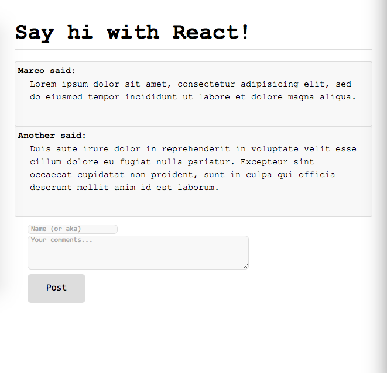
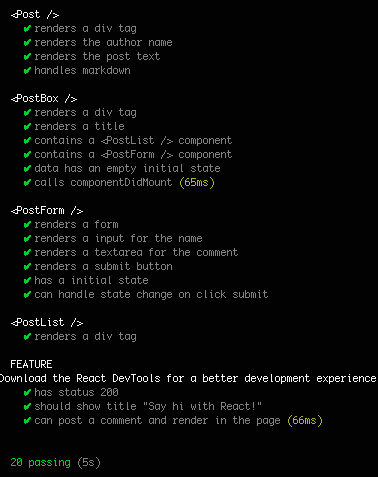

# React Discussion Board
This is a React exercise.

## How to use:
- Download and unzip this repository.

- Open `index.html` on your browser.

- That is it! React will do the rest.

.

## If you want to save you comments:
Opening the file `index.html` won't save your comments as it is running entirely in you browser. If you want to close the browser, come back to it and still see you comments. Do the following:

Run `npm install`, `npm start` and visit <http://localhost:3000/>.

#### See Tests:
Run `npm test`

#### User stories:

```
As a user
So I know what people think
I want to see a a list of opinions
```
```
As a user
So people can know what I think
I want to post my opinion to the board
```




> If any change is made to any script, run `npm run browserify` to compile ES6 and React.
